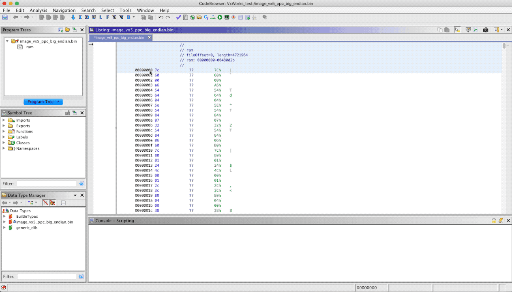

# VxHunter 
A ToolSet for VxWorks Based Embedded Device Analyses.

## Firmware Analyze Tool
The firmware analyze tool is plugins written in Python, mainly used for analyze firmware loading address, fix function name with symbol table and etc.

supported reverse tool: 
* IDA Pro 7.x
* Ghidra 9.0.1

Tested firmware:
* Schneider 140NOE77101 - Ethernet network TCP/IP module
* Siemens SCALANCE-X208/SCALANCE-X216/SCALANCE-X308 - Siemens SCALANCE X Switch
* Hirschmann PowerMICE - Industrial ETHERNET Switch

### IDA Demo

### Ghidra Demo
[How to use VxHunter firmware tools in Ghidra](docs/How_to_use_vxhunter_firmware_tools_in_ghidra.md)

## VxSerial Debugger - Beta
The serial debugger tool is written in Python and based on VxWorks command line, usually we can get that command line from VxWorks device using serial port. 

The serial debugger tool using memory read/write command to inject debugger shellcode into targat system, the shellcode is dynamic generation by keystone-engine. 

It's similar to inline hook, if target hit the breakpoint, it will jump to debugger shellcode and waiting for other debug command. 

The serial debugger tool support functions:
* Memory read/write function.
* Conditional breakpoint, Python based conditional function, return True to break, False to keep running.
* Task status viewer(stacks, register).
* VxWorks struct viewer(netpool, clBlk, etc).

### Example
This is an example script to debug CVE-2018-19528 vulnerability on TP-Link TL-WR886N-V7 deivce with Firmware V1.1.0.

[Serial Debugger Example Script](serial_debugger_example.py)

Demo Video

