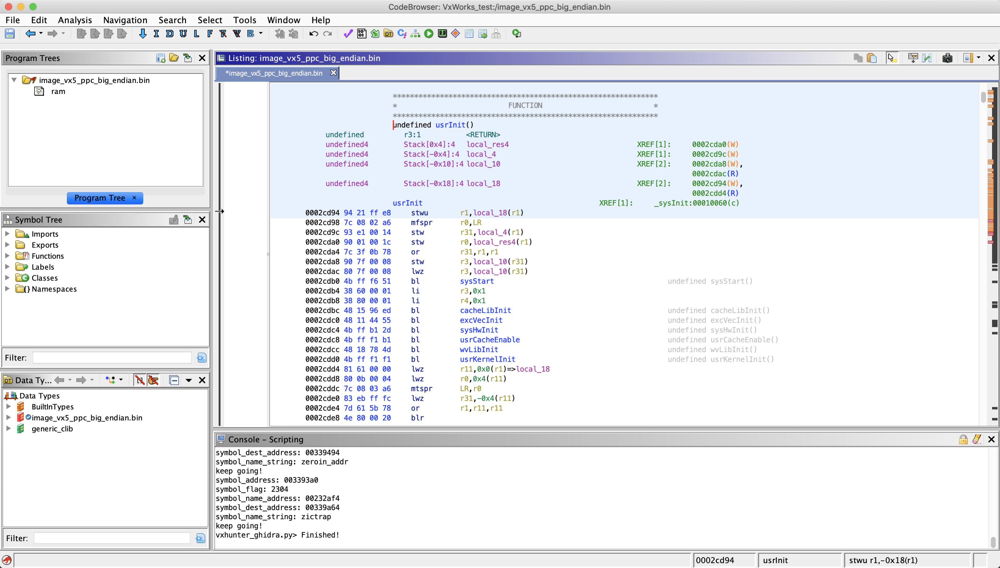

# How to use VxHunter firmware tools in ghidra

VxHunter Ghidra script can analyze Vxworks image load address and symbols automatically.

## step 1: Load VxWorks image to Ghidra
You can found some example VxWorks firmware at [here](https://github.com/dark-lbp/vxhunter/tree/master/example_firmware), in this document we chose [image_vx5_ppc_big_endian.bin](https://github.com/dark-lbp/vxhunter/blob/master/example_firmware/image_vx5_ppc_big_endian.bin).

Load VxWorks image to Ghidra with correct processor type with default load address zero.

Don't analyze image this time, since we don't known the correct load address.

## step 2: Running VxHunter script

Run VxHunter vxhunter_ghidra.py in script manager, this script will rebase image to correct load address and fix the function name.

## step 3: Enjoy

All done, you can start analyze the firmware.

