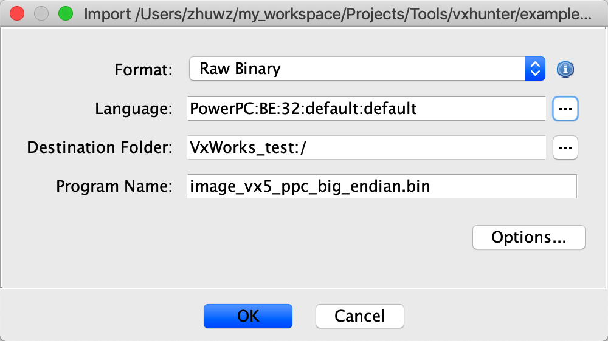
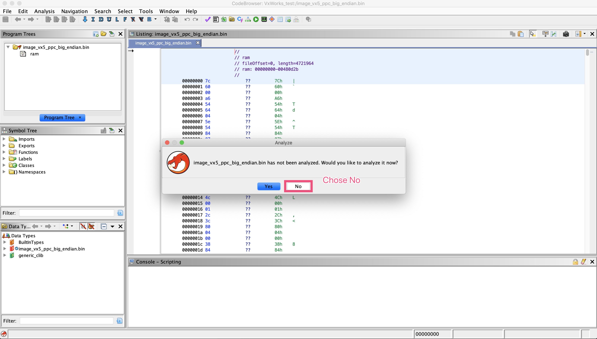
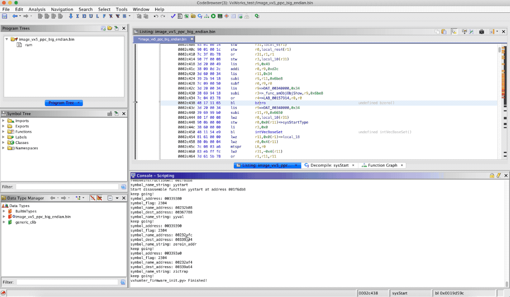

# 如何在Ghidra中使用VxHunter

VxHunter Ghidra脚本能自动分析VxWorks镜像的加载地址及符号信息。

## 步骤一: 在Ghidra中加载VxWorks镜像
示例固件 [下载地址](https://github.com/dark-lbp/vxhunter/tree/master/example_firmware), 在这里我们使用固件是[image_vx5_ppc_big_endian.bin](https://github.com/dark-lbp/vxhunter/blob/master/example_firmware/image_vx5_ppc_big_endian.bin).

使用正确的处理器类型及默认加载地址0来加载VxWorks镜像。

因为此时我们并不知道正确的加载地址，因此先不要对镜像进行自动分析。

## 步骤二: 运行VxHunter firmware init脚本

在脚本管理器中运行VxHunter vxhunter_firmware_init.py脚本, 这个脚本会将镜像rebase到正确的加载地址并根据符号修复函数名。

## 步骤三: 使用vxhunter_analysis脚本分析硬编码账号及已编入的VxWorks服务

至此就可以自由的对这个VxWorks固件进行分析了。

