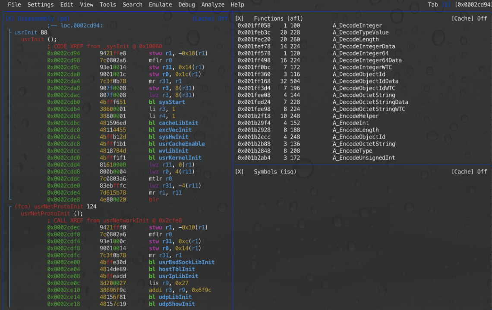

# How to use VxHunter firmware tools in radare2

VxHunter Ghidra script can analyze Vxworks image load address and symbols automatically.


## Step 1: Open VxWorks image with radare2
You can find some example VxWorks firmware at [here](https://github.com/dark-lbp/vxhunter/tree/master/example_firmware), in this document we chose [image_vx5_ppc_big_endian.bin](https://github.com/dark-lbp/vxhunter/blob/master/example_firmware/image_vx5_ppc_big_endian.bin).

Load VxWorks image into radare2 with the correct processor type.

```
r2 -a ppc -b 32 image_vx5_ppc_big_endian.bin
```

## Step 2: Run VxHunter r2 script with r2pipe and python

Two versions of VxHunter r2 have been developed for: Python 2 and Python 3.

```
# for python2
#!pipe python2 ./vxhunter_r2_py2.py

# for python3
#!pipe python3 ./vxhunter_r2_py3.py
```

VxHunter r2 can automatically detect VxWorks version by searching for known VxWorks firmware hints and strings.
If VxHunter cannot determine the VxWorks version, it will ask for your feedback inside r2.

```
[0x00000000]> #!pipe python3 ./vxhunter_r2_py3.py # for python2
Running with python version: 3.7.4 (default, Sep  7 2019, 18:27:02)
[Clang 10.0.1 (clang-1001.0.46.4)]
Auto detected VxWorks version: None
Please input the VxWorks main version type 'c' to exit
Available (5/6/c): 5
vx_version:5
```

You can setup the VxWorks version as the first script parameter too:

```
[[0x00000000]> #!pipe python3 ./vxhunter_r2_py3.py 5
Running with python version: 3.7.4 (default, Sep  7 2019, 18:27:02)
[Clang 10.0.1 (clang-1001.0.46.4)]
vx_version:5
firmware_path: /path/image_vx5_ppc_big_endian.bin
[INFO    ][vxhunter_r2_py3.find_symbol_table] symbol table start offset: 0x301e60
[INFO    ][vxhunter_r2_py3.find_symbol_table] symbol table end offset: 0x3293b0
```

VxHunter will analyze Vxworks image load address and symbols, if succeed you will get some output like this:

```
###### Start analyze firmware ######

[INFO    ][vxhunter_r2_py3.quick_test] load address is not:0x80002000
[INFO    ][vxhunter_r2_py3._check_load_address] load address is :0x10000
Found VxWorks image load address: 0x00010000
Found VxWorks symbol table from 0x00301E60 to 0x003293B0

###### Rebase current firmware ######

All core files, io, anal and flags info purged.
Rebase with r2 command: o /Users/zhuwz/temp/VxHunter_r2/image_vx5_ppc_big_endian.bin 0x10000 r-x

###### Start analyzing functions######

symbol_table_start_address: 0x00311E60
symbol_table_end_address: 0x003393B0
af: Cannot find function at 0x0002986c
af: Cannot find function at 0x0002983c
af: Cannot find function at 0x002275b0
... 


###### Finish here is the flags ######
    0 . classes
 9086 . functions
    0 . relocs
    0 . sections
    0 . segments
 2155 * symbols
```

## Step 3: Have fun

All done, you can start analyze the firmware, have fun.

### search functions
```
[0x00000000]> f functions
[0x00000000]> f |grep usrI
0x0002b8e4 180 usrIpLibInit
0x0002cd94 88 usrInit
0x0002d1d8 80 usrIosCoreInit
0x0002d228 100 usrIosExtraInit
```

### view functions

